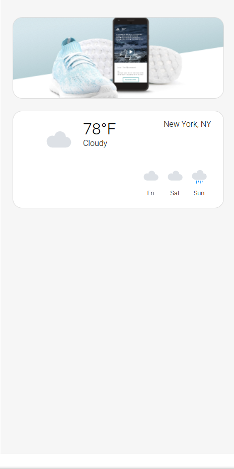
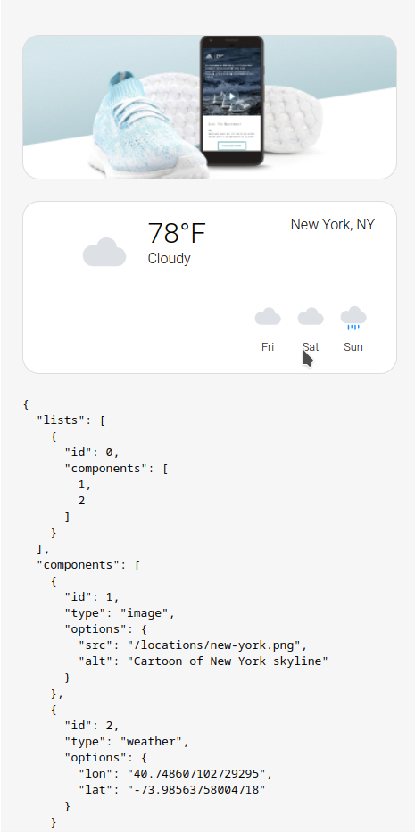
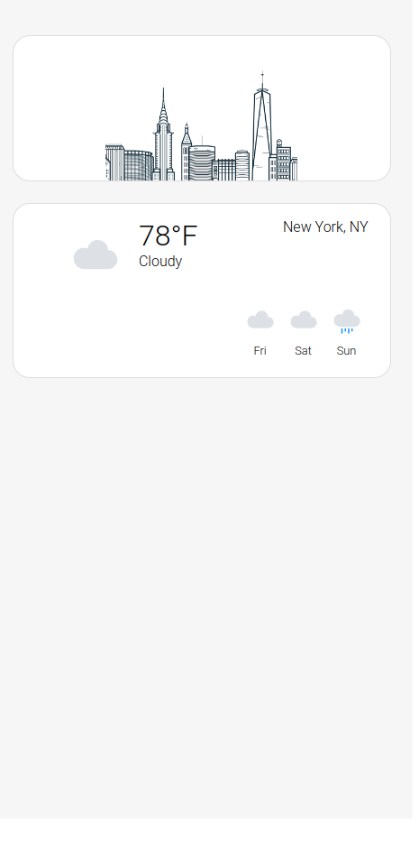

# Blue Bite Assessment

## Developer Notes

I am not a React developer, I used Vue on 90% of my projects. I dislike React because of JSX

In Vue I use PUG as HTML preprocessor and Stylus as CSS preprocessor, so I can write CSS way faster while using advanced features.

There's no simple way to use PUG or Stylus preprocessor with React, so I had to resort with plain JSX and SCSS.

I do not like the idea of CSS-in-JS, as it mixes concepts. So I do not use CSS modules.

For same reason of mixing concepts, I do not to use Tailwind and its family frameworkds.

### Tag v0.1

```bash
git checkout v0.1
```

Remembering React perks, I have created basic layout using Components, no data request implemented yet.

So I, as a developer with freelance experience, first created the html/css layout, and made it look like this already:



Then I'd like to properly read original README.MD and see projects requirements again, to see if I should load data per-card or on page level.

When I got to the point

> Conditions are components that render their children list when a specific variable is equal to the given value.

I was confused, so I checked API endpoints and realised that backend not just provides data but also has declarations on which components to render.


### Tag v0.2

```bash
git checkout v0.2
```

At this point UX looked like this



### Tag v0.3

```bash
git checkout v0.3
```

Then, as we had conditional components, I created component Factory.

Then, I had to rename Card01 to **Image** and Card02 to **Weather**


```bash
git checkout v0.4
```

Then, passed the image options to Image component as props. I am used to use background images for decorative purposes, so I left it as background, without alt.

Weather component data, however, only contained lat/long and was useless for display, so I left **mock data** in place in **Weather** component.


